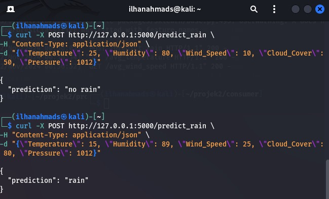
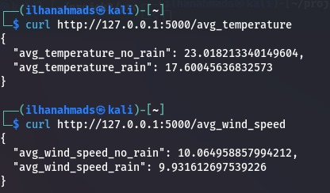

# Project 2 Big Data

| No  | Nama                    | NRP         |
| --- | ----------------------- | ----------- |
| 1   | M. Januar Eko Wicaksono | 50272221006 |
| 2   | Iki Adfi Nur Mohamad    | 50272221033 |
| 3   | Ilhan Ahmad Syafa       | 50272221040 |

---

## Tentang Dataset

Weather Forecast

- Dataset This dataset is ideal for beginners looking to practice machine learning, specifically using classification techniques.

- With 2,500 weather observations, it’s a simple yet practical dataset for learning how to predict rainfall based on various weather conditions.

- Perfect for use with Python libraries like scikit-learn, this dataset enables experimentation with algorithms such as logistic regression , decision trees , and random forests .

- The dataset's straightforward structure makes it accessible for those new to classification problems and interested in weather data analysis.

---

## Tujuan

User akan melakukan request ke API. API akan memberikan respon sesuai dengan request user. Dalam project kami, apabila user melakukan request rekomendasi, maka input yang diperlukan adalah beberapa data yang sesuai dengan kolom dataset antara lain: Temperature, Humidity, Wind_Speed, Cloud_Cover, Pressure, dan Rain dari user dan response yang diberikan adalah daftar yang mereka ingin ketahui.

Terdapat 3 endpoint API untuk request user:

- Endpoint untuk memprediksi kemungkinan hujan `http://121.0.0.1:5000/predict_rain`.

- Endpoint untuk mengetahui rata-rata temperatur saat hujan/ tidak `http://121.0.0.1:5000/avg_temperature` . Ini bisa digunakan sebagai parameter monitoring peningkatan suhu cuaca juga.

- Endpoint untuk mengetahui rata-rata kecepatan angin saat hujan/ tidak `http://121.0.0.1:5000/avg_wind_speed`. Ini bisa digunakan sebagai prediksi akankah cuaca tersebut memicu badai angin kencang

---

## Setup

#### A. Requirements

- Docker
- Java (Java 11 recommended)
- Pyspark
- Kafka
- Apache Spark

#### B. Get Started

#### C. Source Code

- `consumer.py` digunakan untuk menerima data yang dikirim dari producer berdasarkan dataset yang tersedia

```
from kafka import KafkaConsumer
import json

# Inisialisasi Kafka Consumer
consumer = KafkaConsumer(
    'weather-topic',  # Topic
    bootstrap_servers='localhost:9092',
    group_id='weather-group',
    value_deserializer=lambda m: json.loads(m.decode('utf-8'))
)

# Menyimpan data dalam batch
batch_size = 100
batch = []
batch_counter = 1
row_counter = 0
max_rows = 2500

all_data = []

for message in consumer:
    batch.append(message.value)
    row_counter += 1

    if len(batch) >= batch_size:
        print(f"Saving batch {batch_counter} with rows {row_counter - batch_size + 1} to {row_counter}...")

        with open(f"batch_{batch_counter}.json", 'w') as f:
            json.dump(batch, f)  # Menyimpan batch dalam format JSON

        # Menambahkan batch yang telah diproses ke dalam data lengkap
        all_data.extend(batch)

        batch = []
        batch_counter += 1

    if row_counter >= max_rows:
        print(f"Processed {row_counter} rows. Stopping Kafka Consumer.")
        break

# Pastikan consumer berhenti setelah mencapai 2500 baris
consumer.close()

# Menyimpan data lengkap ke file untuk pelatihan model
with open("all_data.json", 'w') as f:
    json.dump(all_data, f)

```

- `producer.py` digunakan untuk mengirim data ke consumer berdasarkan dataset yang tersedia

```
import pandas as pd
import random
import time
from kafka import KafkaProducer
import json

# Membaca dataset
data = pd.read_csv('/home/ilhanahmads/projek2/data/weather_forecast_data.csv')

# Inisialisasi producer Kafka
producer = KafkaProducer(bootstrap_servers='localhost:9092',
                         value_serializer=lambda v: json.dumps(v).encode('utf-8'))

# Kafka topic tempat data akan dikirim
topic = 'weather-topic'

# Mengirimkan data satu baris per waktu
for _, row in data.iterrows():
    message = row.to_dict()  # Mengubah baris menjadi dictionary
    producer.send(topic, value=message)  # Mengirim data ke Kafka

    # Simulasikan delay acak antara 0.1 sampai 1 detik
    time.sleep(random.uniform(0.1, 1.0))

# Pastikan semua pesan terkirim sebelum keluar
producer.flush()
producer.close()

```

- `prep_data.py` digunakan untuk memisahkan data yang akan digunakan untuk melatih model

```
import json
# Membaca data dari file all_data.json
with open("/home/ilhanahmads/projek2/consumer/all_data.json", 'r') as f:
    all_data = json.load(f)

# Menentukan jumlah data untuk setiap model
model_1_data = all_data[:800]  # 800 data pertama
model_2_data = all_data[:1600]  # 800 data pertama + 800 data kedua
model_3_data = all_data[:]  # 800 data pertama + 800 data kedua + 900 data ketiga

# Menyimpan data yang dibagi ke dalam file terpisah untuk setiap model
with open("model_1_data.json", 'w') as f:
    json.dump(model_1_data, f)

with open("model_2_data.json", 'w') as f:
    json.dump(model_2_data, f)

with open("model_3_data.json", 'w') as f:
    json.dump(model_3_data, f)

print("Data successfully split into model training datasets.")
```

- `train_model.py` digunakan untuk melatih model berdasarkan batch data yang diterima consumer

```
import json
import pandas as pd
import numpy as np
from sklearn.ensemble import RandomForestClassifier
from sklearn.model_selection import train_test_split
from sklearn.metrics import accuracy_score
import joblib

def prepare_data(file_path, features, target, num_rows):
    # Membaca data dari file JSON
    with open(file_path, 'r') as f:
        data = json.load(f)

    # Mengubah data ke dalam format DataFrame
    df = pd.DataFrame(data)

    # Melakukan Exploratory Data Analysis (EDA)
    print("Data Overview:")
    print(df.head())
    print("\nSummary Statistics:")
    print(df.describe())

    # Memilih jumlah data sesuai dengan parameter num_rows
    df = df.head(num_rows)

    # Memisahkan fitur dan target
    X = df[features]  # Fitur yang digunakan untuk pelatihan
    y = df[target]  # Target yang ingin diprediksi
    return X, y, df

# Model 1: Prediksi Rain dengan 800 data pertama
def train_model_1():
    features = ['Temperature', 'Humidity', 'Pressure', 'Wind_Speed', 'Cloud_Cover']
    target = 'Rain'  # Kolom target untuk prediksi hujan

    # Menyiapkan data dari file model_data.json dengan 800 data pertama
    X, y, df = prepare_data('model_1_data.json', features, target, 800)

    # Membagi data menjadi training dan testing set
    X_train, X_test, y_train, y_test = train_test_split(X, y, test_size=0.2, random_state=42)

    # Membuat dan melatih model RandomForestClassifier
    model_1 = RandomForestClassifier(n_estimators=100, random_state=42)
    model_1.fit(X_train, y_train)

    # Evaluasi model
    y_pred = model_1.predict(X_test)
    accuracy = accuracy_score(y_test, y_pred)
    print(f"Model 1 (Rain Prediction - 800 data): Accuracy = {accuracy:.4f}")

    # Menyimpan model
    joblib.dump(model_1, 'model_1.pkl')

    # Prediksi nilai target 'rain' untuk data yang ada
    df['Predicted_Rain'] = model_1.predict(X)
    print("\nPredictions for Rain using Machine Learning (Model 1 - 800 data):")
    print(df[['Temperature', 'Humidity', 'Pressure', 'Predicted_Rain']].head())

# Model 2: Prediksi Rain dengan 1600 data pertama
def train_model_2():
    features = ['Temperature', 'Humidity', 'Pressure', 'Wind_Speed', 'Cloud_Cover']
    target = 'Rain'  # Kolom target untuk prediksi hujan

    # Menyiapkan data dari file model_data.json dengan 1600 data pertama
    X, y, df = prepare_data('model_2_data.json', features, target, 1600)

    # Membagi data menjadi training dan testing set
    X_train, X_test, y_train, y_test = train_test_split(X, y, test_size=0.2, random_state=42)

    # Membuat dan melatih model RandomForestClassifier
    model_2 = RandomForestClassifier(n_estimators=100, random_state=42)
    model_2.fit(X_train, y_train)

    # Evaluasi model
    y_pred = model_2.predict(X_test)
    accuracy = accuracy_score(y_test, y_pred)
    print(f"Model 2 (Rain Prediction - 1600 data): Accuracy = {accuracy:.4f}")

    # Menyimpan model
    joblib.dump(model_2, 'model_2.pkl')

    # Prediksi nilai target 'rain' untuk data yang ada
    df['Predicted_Rain'] = model_2.predict(X)
    print("\nPredictions for Rain using Machine Learning (Model 2 - 1600 data):")
    print(df[['Temperature', 'Humidity', 'Pressure', 'Predicted_Rain']].head())

# Model 3: Prediksi Rain dengan semua data (2500 data)
def train_model_3():
    features = ['Temperature', 'Humidity', 'Pressure', 'Wind_Speed', 'Cloud_Cover']
    target = 'Rain'  # Kolom target untuk prediksi hujan

    # Menyiapkan data dari file model_data.json dengan semua data (2500)
    X, y, df = prepare_data('model_3_data.json', features, target, 2500)

    # Membagi data menjadi training dan testing set
    X_train, X_test, y_train, y_test = train_test_split(X, y, test_size=0.2, random_state=42)

    # Membuat dan melatih model RandomForestClassifier
    model_3 = RandomForestClassifier(n_estimators=100, random_state=42)
    model_3.fit(X_train, y_train)

    # Evaluasi model
    y_pred = model_3.predict(X_test)
    accuracy = accuracy_score(y_test, y_pred)
    print(f"Model 3 (Rain Prediction - 2500 data): Accuracy = {accuracy:.4f}")

    # Menyimpan model
    joblib.dump(model_3, 'model_3.pkl')

    # Prediksi nilai target 'rain' untuk data yang ada
    df['Predicted_Rain'] = model_3.predict(X)
    print("\nPredictions for Rain using Machine Learning (Model 3 - 2500 data):")
    print(df[['Temperature', 'Humidity', 'Pressure', 'Predicted_Rain']].head())

# Fungsi utama untuk melatih semua model
def train_all_models():
    train_model_1()
    train_model_2()
    train_model_3()

if __name__ == "__main__":
    train_all_models()


```

- `docker-compose.yaml` digunakan untuk mengatur konfigurasi docker beberapa service yang dibutuhkan

```
version: '3.9'

services:
  zookeeper:
    image: 'bitnami/zookeeper:latest'
    container_name: zookeeper
    environment:
      - ALLOW_ANONYMOUS_LOGIN=yes
    ports:
      - '2181:2181'

  kafka:
    image: 'bitnami/kafka:latest'
    container_name: kafka
    environment:
      - KAFKA_BROKER_ID=1
      - KAFKA_ZOOKEEPER_CONNECT=zookeeper:2181
      - ALLOW_PLAINTEXT_LISTENER=yes
      - KAFKA_LISTENERS=PLAINTEXT://:9092
      - KAFKA_ADVERTISED_LISTENERS=PLAINTEXT://localhost:9092
    ports:
      - '9092:9092'
    depends_on:
      - zookeeper

  spark-master:
    image: bitnami/spark:latest
    container_name: spark-master
    environment:
      - SPARK_MODE=master
    ports:
      - '7077:7077'

  pyspark:
    image: 'jupyter/pyspark-notebook:latest'
    container_name: pyspark
    environment:
      - SPARK_MASTER=spark://spark-master:7077
    volumes:
      - ./pyspark:/home/jovyan/work
      - ./data:/home/jovyan/data
      - ./models:/home/jovyan/models
    ports:
      - '8888:8888'
    command: start-notebook.sh --NotebookApp.token=''


```

- `app.py` digunakan untuk routing endpoint

```
SOURCE CODE MASUKIN
```

---

## Langkah-Langkah

#### 1. Setup Docker

Atur konfigurasi docker pada file `docker-compose.yaml` sesuai kebutuhan kemudian jalankan command `docker-compose up -d` untuk menjalankan service yang dibutuhkan

#### 2. Setup Producer dan Consumer

Buat script untuk menjalankan skenario producer dan consumer. Pastikan consumer dapat menerima aliran data yang dikirim producer berdasarkan dataset yang tersedia. <br><br>


#### 3. Modelling Data

---

## Hasil



### **1. Endpoint API:**

Endpoint yang digunakan adalah `http://127.0.0.1:5000/predict_rain`.

### **2. Request dan Response (Hasil):**

API menerima data dalam format JSON yang berisi beberapa parameter cuaca sebagai input, dan memberikan prediksi apakah akan terjadi hujan atau tidak.

#### **Hasil Pertama:**

**Request Input JSON:**

```json
{
  "Temperature": 25,
  "Humidity": 80,
  "Wind_Speed": 10,
  "Cloud_Cover": 0,
  "Pressure": 1012
}
```

- **Response Output JSON:**

```json
{
  "prediction": "no rain"
}
```

API memprediksi **"tidak hujan" (no rain)** karena kombinasi nilai-nilai tersebut menunjukkan kondisi yang cenderung tidak mendukung hujan (misalnya, cakupan awan yang nol).

#### **Hasil Kedua:**

**Request Input JSON:**

```json
{
  "Temperature": 15,
  "Humidity": 89,
  "Wind_Speed": 25,
  "Cloud_Cover": 80,
  "Pressure": 1012
}
```

- **Response Output JSON:**

```json
{
  "prediction": "rain"
}
```

API memprediksi **"hujan" (rain)** karena kombinasi parameter ini menunjukkan kondisi atmosfer yang mendukung terjadinya hujan (kelembapan tinggi dan cakupan awan besar).



Gambar ini menunjukkan hasil dari permintaan API untuk mendapatkan rata-rata dua parameter cuaca, yaitu suhu dan kecepatan angin, berdasarkan kondisi **"hujan" (rain)** atau **"tidak hujan" (no rain)**.

### **1. Endpoint API: `/avg_temperature`**

- **Request:**
  ```bash
  curl http://127.0.0.1:5000/avg_temperature
  ```
- **Response JSON:**

  ```json
  {
    "avg_temperature_no_rain": 23.018213340149604,
    "avg_temperature_rain": 17.60045636832573
  }
  ```

- **`avg_temperature_no_rain`:** Nilai rata-rata suhu saat **tidak hujan** adalah sekitar **23.02°C**.
- **`avg_temperature_rain`:** Nilai rata-rata suhu saat **hujan** adalah sekitar **17.60°C**.
- Dari data ini, dapat disimpulkan bahwa suhu rata-rata lebih rendah saat hujan dibandingkan saat tidak hujan, yang sesuai dengan logika cuaca (kondisi hujan sering terjadi pada suhu lebih dingin).

### **2. Endpoint API: `/avg_wind_speed`**

- **Request:**
  ```bash
  curl http://127.0.0.1:5000/avg_wind_speed
  ```
- **Response JSON:**

  ```json
  {
    "avg_wind_speed_no_rain": 10.064958857994212,
    "avg_wind_speed_rain": 9.931612697539226
  }
  ```

- **`avg_wind_speed_no_rain`:** Nilai rata-rata kecepatan angin saat **tidak hujan** adalah sekitar **10.06**.
- **`avg_wind_speed_rain`:** Nilai rata-rata kecepatan angin saat **hujan** adalah sekitar **9.93**.
- Dari data ini, kecepatan angin saat hujan sedikit lebih rendah dibandingkan saat tidak hujan. Namun, perbedaan nilainya cukup kecil, sehingga kecepatan angin mungkin bukan parameter dominan dalam mempengaruhi prediksi hujan.

---

## Analsis

### **1. Analisis Gambar Pertama (Prediksi hujan/tidak)**


#### **a. Proses Sistem**:

1. **Data Input:**
   - Data dikirim melalui Kafka sebagai _message broker_. Kafka bertugas untuk menerima, menyimpan sementara, dan mendistribusikan data cuaca ke Spark Streaming secara real-time.
   - Parameter input mencakup:
     - Suhu (_Temperature_),
     - Kelembapan (_Humidity_),
     - Kecepatan angin (_Wind Speed_),
     - Cakupan awan (_Cloud Cover_), dan
     - Tekanan udara (_Pressure_).
2. **Spark Processing:**

   - Apache Spark membaca data cuaca dari Kafka dan memprosesnya menggunakan model pembelajaran mesin (ML).
   - Model ini dilatih menggunakan data cuaca historis, mempelajari pola seperti hubungan antara parameter cuaca dan kondisi hujan.

3. **API Response:**
   - Hasil prediksi Spark dikirimkan melalui API Flask di endpoint `/predict_rain`.

#### **b. Analisis Prediksi**

1. **Prediksi 1 (Tidak Hujan):**

   - **Input:**
     - `Temperature`: 25°C,
     - `Humidity`: 80%,
     - `Wind_Speed`: 10,
     - `Cloud_Cover`: 0,
     - `Pressure`: 1012 hPa.
   - **Output:** `{"prediction": "no rain"}`
   - **Analisis:**
     - Suhu cukup hangat (25°C) dan cakupan awan nol menunjukkan kondisi langit cerah.
     - Kelembapan relatif tinggi (80%), tetapi karena tidak ada cakupan awan, kecil kemungkinan terjadi hujan.
     - Sistem memprediksi **tidak hujan** dengan logika bahwa parameter seperti _Cloud Cover_ dan _Humidity_ sangat penting untuk mendukung hujan.

2. **Prediksi 2 (Hujan):**
   - **Input:**
     - `Temperature`: 15°C,
     - `Humidity`: 89%,
     - `Wind_Speed`: 25,
     - `Cloud_Cover`: 80,
     - `Pressure`: 1012 hPa.
   - **Output:** `{"prediction": "rain"}`
   - **Analisis:**
     - Suhu rendah (15°C) menunjukkan kondisi lebih dingin, sering dikaitkan dengan hujan.
     - Kelembapan sangat tinggi (89%) dan cakupan awan besar (80) menunjukkan atmosfer mendukung presipitasi.
     - Sistem memprediksi **hujan** berdasarkan kombinasi parameter atmosfer yang menunjukkan kondisi basah.

### **2. Analisis Gambar Kedua (Rata-Rata Parameter Cuaca)**


#### **a. Endpoint `/avg_temperature`**

- **Hasil:**
  - `avg_temperature_no_rain`: 23.02°C,
  - `avg_temperature_rain`: 17.60°C.
- **Analisis:**
  - **Suhu saat tidak hujan (23.02°C):**
    - Nilai rata-rata ini menunjukkan kondisi yang lebih hangat, sering diasosiasikan dengan langit cerah.
  - **Suhu saat hujan (17.60°C):**
    - Nilai rata-rata yang lebih rendah mencerminkan pola bahwa hujan sering terjadi pada suhu lebih dingin.
  - **Korelasi:** Suhu lebih rendah cenderung meningkatkan peluang hujan karena atmosfer yang lebih dingin mampu menahan lebih sedikit uap air, menyebabkan kondensasi dan presipitasi.

#### **b. Endpoint `/avg_wind_speed`**

- **Hasil:**
  - `avg_wind_speed_no_rain`: 10.06,
  - `avg_wind_speed_rain`: 9.93.
- **Analisis:**
  - **Kecepatan angin saat tidak hujan (10.06):**
    - Nilai ini sedikit lebih tinggi dibandingkan kecepatan angin saat hujan.
    - Angin lebih kencang mungkin terjadi dalam kondisi cerah akibat variasi suhu permukaan yang lebih signifikan.
  - **Kecepatan angin saat hujan (9.93):**
    - Nilai kecepatan angin lebih rendah saat hujan bisa mencerminkan stabilitas atmosfer yang lebih besar saat presipitasi terjadi.
  - **Korelasi:** Tidak ada perbedaan signifikan antara kedua kondisi, sehingga kecepatan angin mungkin memiliki pengaruh kecil terhadap prediksi hujan.

#### **c. Relevansi Analisis**

1. **Menggunakan Kafka:**

   - Kafka memungkinkan pengiriman data cuaca secara real-time, yang kemudian dapat digunakan oleh Spark untuk analisis berkelanjutan. Data stream ini sangat penting untuk sistem prediksi cuaca yang selalu membutuhkan pembaruan kondisi atmosfer terkini.

2. **Spark Streaming:**

   - Spark secara efisien memproses data streaming dari Kafka, termasuk menghitung rata-rata (_mean_) suhu dan kecepatan angin untuk kondisi "hujan" dan "tidak hujan".

   - Pemrosesan ini dapat berjalan pada dataset besar dengan latensi rendah, membuat sistem ideal untuk analisis skala besar.

---

## Kesimpulan

1. **Prediksi Cuaca (Gambar Pertama):**

   - Sistem berbasis Kafka dan Spark mampu memproses data cuaca secara real-time untuk menghasilkan prediksi hujan atau tidak.

   - Kombinasi parameter atmosfer (suhu, kelembapan, cakupan awan) memberikan hasil prediksi yang masuk akal berdasarkan pola umum cuaca.

2. **Analisis Data (Gambar Kedua):**

   - Suhu rata-rata lebih rendah saat hujan dibandingkan saat tidak hujan, menunjukkan bahwa suhu adalah parameter penting dalam prediksi cuaca.

   - Kecepatan angin rata-rata tidak berbeda signifikan antara kondisi hujan dan tidak hujan, sehingga memiliki pengaruh kecil pada prediksi.

3. **Efektivitas Sistem Big Data:**

   - Dengan arsitektur Kafka dan Spark, sistem ini memungkinkan analisis real-time dan berskala besar.

   - Data rata-rata yang dihitung dapat membantu meningkatkan model prediksi, misalnya dengan menetapkan bobot lebih besar pada suhu dan kelembapan, dibandingkan kecepatan angin.

4. **Pola Prediksi Cuaca**

   - Suhu rata-rata lebih rendah saat hujan.

   - Kecepatan angin rata-rata tidak memiliki perbedaan signifikan antara kondisi hujan dan tidak hujan.
